## 一、坐标系与位姿变换

### 1.坐标系

​	为了描述机器人本身的位置和姿态,必须构建坐标系来描述机器人的状态（世界坐标系、机体坐标系）。

​	在平面内一般包含2个移动自由度（x轴、y轴）及1个转动自由度（平面内绕某点）。

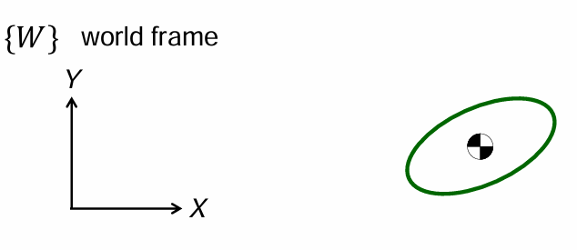

​	在空间中一般包含3个移动自由度（x轴、y轴、z轴）及3个转动自由度（绕x轴、y轴、z轴）。

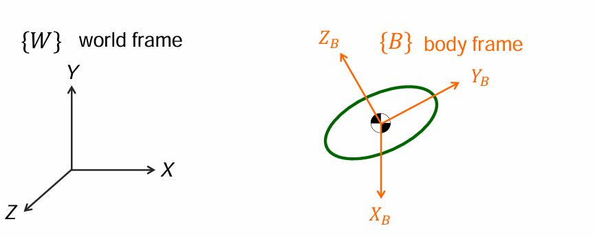

***

### 2.移动

​	平移描述的是物体在空间中位置的变化，即物体在某个方向上移动而不改变其形状和姿态。这种移动可以理解为物体的每个点都沿着相同的方向和距离移动。通过向量描述刚体在空间中的位置（分别在3个轴投影的分量来具体描述）。

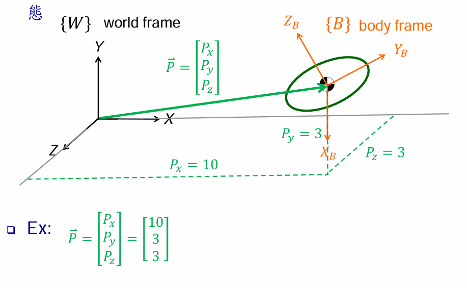

***

### 3.旋转

#### 3.1旋转矩阵

​	旋转是刚体绕平面内一点或某个轴的转动，其位置和方向会发生变化，但形状和大小保持不变。旋转描述了物体相对于某个参考点的朝向变化，通常用于表示物体的姿态调整。

​	我们知道点的位置可以用矢量描述，而物体的姿态我们可以用固定在物体上的坐标系来描述。

​	我们想要知道物体{B}相对于坐标系{A}的姿态时，可以将坐标系{B}的三个主轴方向的单位矢量分别相对于坐标系{A}的各轴的分量按照X、Y、Z的顺序组成一个3×3的矩阵，我们称这个矩阵为——**旋转矩阵**。

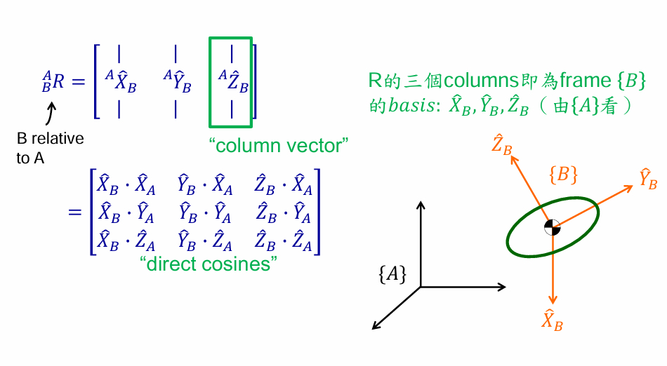

***

##### 旋转矩阵的特性

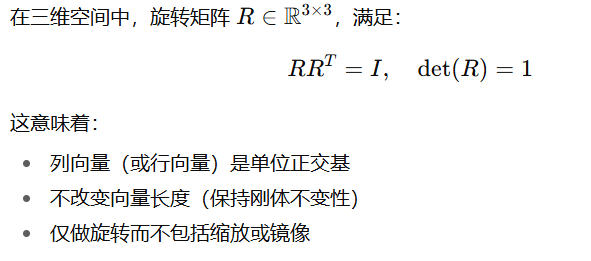

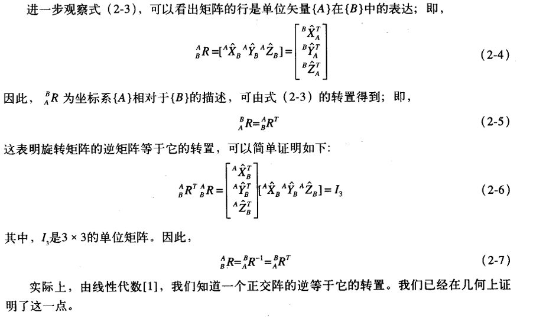

***

##### 旋转矩阵的常见形式

1、绕x轴旋转角度θ

​	绕x轴旋转时，x坐标不变，y和z坐标发生变换：

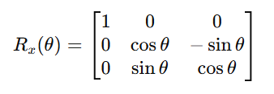

2.绕y轴旋转角度θ

​	绕y轴旋转时，y坐标不变，x和z坐标发生变换：

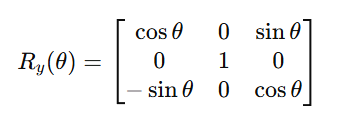

3.绕z轴旋转角度θ

​	绕z轴旋转时，z坐标不变，x和y坐标发生变换：

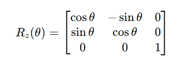

***

##### 旋转矩阵的三种用法

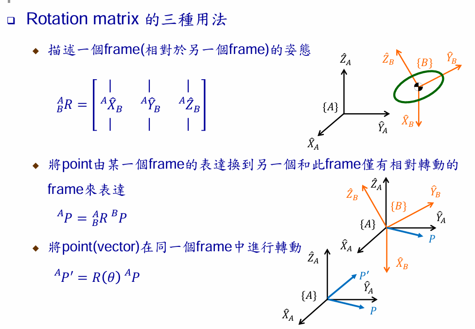

***

#### 齐次变换矩阵

​	在三维空间中，刚体的位姿（Pose）= 位置（Position, 平移）+ 姿态（Orientation, 旋转）。我们在旋转矩阵的基础上加入位移，通常使用一个4×4的齐次矩阵来表示：

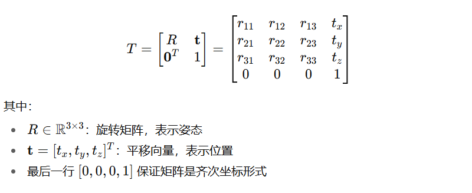

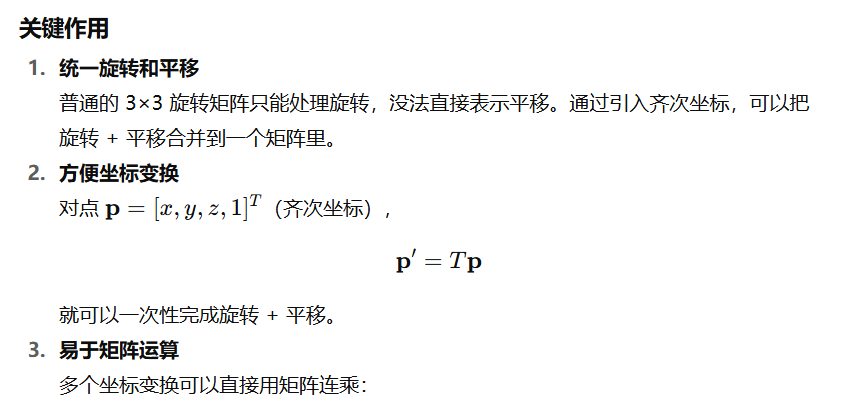

***

#### 3.2欧拉角

- 欧拉角用 **三个角度** 来描述空间中的一个旋转。  
- 本质：把一个坐标系通过 **依次绕某些轴的旋转** 变换到另一个姿态。

常见的旋转顺序：  
- **Z-Y-X（yaw-pitch-roll）** 航空航天、机器人学常见  
- **Z-Y-Z**  机械臂运动学（DH 参数法）常见  

以常见的 **Z-Y-X (Yaw-Pitch-Roll)** 为例：   

- 滚转角 （roll，绕 X 轴旋转）  

- 俯仰角 （pitch，绕 Y 轴旋转）  

- 偏航角 （yaw，绕 Z 轴旋转）  

  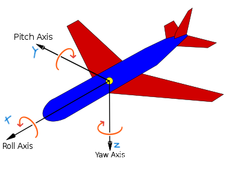

##### 欧拉角的优缺点

✅ 优点：  
- 直观（和飞机的航向、俯仰、翻滚一致）  
- 只用 3 个参数（比旋转矩阵 9 个参数更简洁）  

⚠️ 缺点：  
- 存在 **万向节锁死 (gimbal lock)**，某些角度下失去一个自由度  

- 不唯一：不同的旋转顺序、不同角度组合可能表示同一个姿态  

>注：万向节 (Gimbal) 是一种用三个转环实现三维旋转的机构，每个环负责一个角度（yaw, pitch, roll）。当中间的环转到某个角度时（通常是 ±90°），两个旋转轴会重合。这样原本独立的 3 个自由度瞬间变成 2 个自由度，系统丢失了一个旋转方向。这就是所谓的 万向节锁死。

#####  总结

- 欧拉角：用 **3 个角度** 表示旋转  
- 通过三个基本旋转矩阵相乘得到整体旋转  
- 常用形式：**Z-Y-X (yaw-pitch-roll)**  
- 优点：直观简洁  
- 缺点：存在奇异性，数值计算上常用 **旋转矩阵** 或 **四元数**

***

#### 3.3四元数

##### 1. 定义

一个四元数可以写作：  
$$
q = w + xi + yj + zk
$$
其中：  
- w：实部  
- x, y, z：虚部（向量部分）

在旋转应用中，四元数通常记为：  
$$
q = \begin{pmatrix} w \\ x \\ y \\ z \end{pmatrix}
$$

---

##### 2. 单位四元数与旋转

旋转用 **单位四元数**（模长 = 1）表示：  
$$
q = \cos\frac{\theta}{2} + \sin\frac{\theta}{2}(u_x i + u_y j + u_z k)
$$
等价于：  
$$
q = 
\begin{pmatrix}
\cos\frac{\theta}{2} \\
u_x \sin\frac{\theta}{2} \\
u_y \sin\frac{\theta}{2} \\
u_z \sin\frac{\theta}{2}
\end{pmatrix}
$$
其中：  
- 旋转角:$θ$  

- $(u_x, u_y, u_z)$：旋转轴单位向量 

  > **注** 旋转轴的几何意义:
  >
  > - 旋转轴就是一个 **固定的方向向量**，代表物体绕着它进行旋转。
  > - 单位化（长度为 1）保证四元数的模长为 1，从而表示**纯旋转**（不缩放）。
  > - 比如：
  >   - $(1,0,0)$ 绕 **X 轴** 旋转
  >   - $(0,1,0)$ 绕 **Y 轴** 旋转
  >   - $(0,0,1)$ 绕 **Z 轴** 旋转
  >   - $(\tfrac{1}{\sqrt{2}}, 0, \tfrac{1}{\sqrt{2}})$  绕 **X-Z 平面 45°方向的轴** 旋转
---

##### 3. 四元数与旋转矩阵互换

**从四元数到旋转矩阵：**

设 $q = (w, x, y, z)$，则：  

$$
R =
\begin{bmatrix}
1 - 2(y^2+z^2) & 2(xy - wz) & 2(xz + wy) \\
2(xy + wz) & 1 - 2(x^2+z^2) & 2(yz - wx) \\
2(xz - wy) & 2(yz + wx) & 1 - 2(x^2+y^2)
\end{bmatrix}
$$

**从旋转矩阵到四元数：**

如果 $R$ 已知，可以用： 
$$
w = \tfrac{1}{2}\sqrt{1 + R_{11} + R_{22} + R_{33}}
$$

$$
x = \tfrac{R_{32} - R_{23}}{4w}, \quad
y = \tfrac{R_{13} - R_{31}}{4w}, \quad
z = \tfrac{R_{21} - R_{12}}{4w}
$$

##### 4.四元数的优缺点

✅ **优点**：  
- 没有奇异性（不像欧拉角的万向节锁死）  
- 表达简洁（4 个参数，比旋转矩阵 9 个参数少）  
- 易于插值（适合动画、路径规划：球面线性插值 Slerp）  

⚠️ **缺点**：  
- 不如欧拉角直观  
- 需要保持归一化（数值计算时会有误差积累）  

##### 5. 总结

- 四元数用 4 个数表示旋转，克服了欧拉角的缺陷

- 在机器人学、计算机图形学、无人机控制中广泛使用  
- 常和旋转矩阵、欧拉角互相转换

***

### 4.三维旋转的多种表示方法比较

| 方法                           | 参数数量                                 | 表达直观性                       | 是否唯一                           | 是否有奇异性     | 运算复杂度             | 常见应用                         |
| ------------------------------ | ---------------------------------------- | -------------------------------- | ---------------------------------- | ---------------- | ---------------------- | -------------------------------- |
| **旋转矩阵 (Rotation Matrix)** | 9 个参数（3×3矩阵，约束后有效参数 3 个） | 中等（通过矩阵作用可以直观理解） | 唯一                               | 无               | 矩阵乘法，开销较大     | 机器人运动学、坐标变换           |
| **欧拉角 (Euler Angles)**      | 3 个参数                                 | 非常直观（航向、俯仰、翻滚）     | 不唯一（不同旋转顺序表示相同姿态） | 有（万向节锁死） | 简单                   | 飞行器姿态、机械臂 DH 参数       |
| **四元数 (Quaternion)**        | 4 个参数（1 个约束，实质 3 个）          | 不直观                           | 唯一（单位四元数）                 | 无               | 乘法运算高效，易于插值 | 机器人控制、无人机、图形学、SLAM |

---

#### 总结

- **旋转矩阵**：适合直接做坐标变换，稳定但冗余（9 参数）。  

- **欧拉角**：最直观，但有奇异性，不适合连续旋转计算。  

- **四元数**：数值稳定、计算高效、插值自然 机器人、图形学首选。  

    

